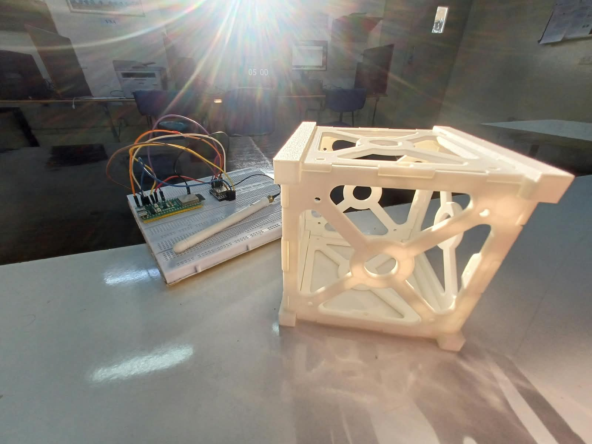
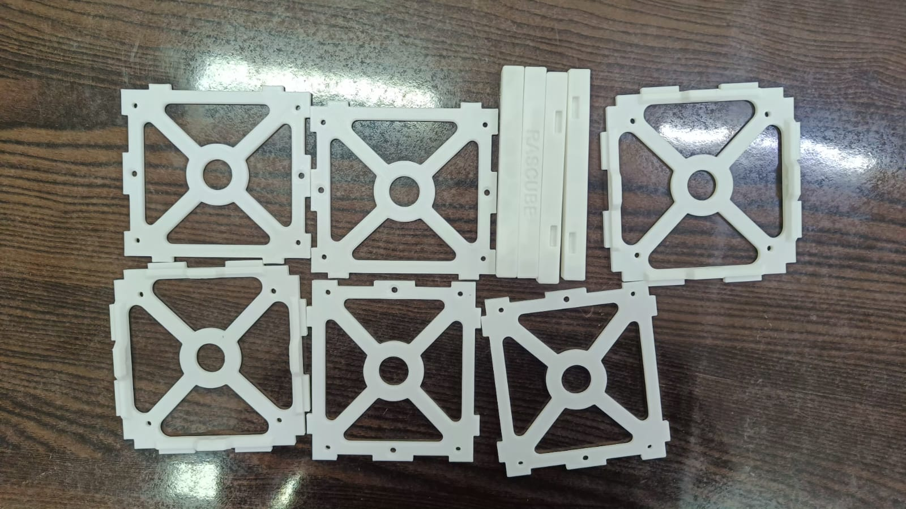

# RasCube 1U

A small experimental 1U CubeSat-style flight stack built around an **ESP32-S3 N16R8**.

The project currently focuses on the hardware bring-up and communication layer. The first firmware examples test the **SX1278 Ra-02 433 MHz LoRa module**.

> This repository is intentionally kept simple for the initial project stage. More sensors, telemetry, camera, storage, and flight software can be added later.

## Current hardware

- ESP32-S3 N16R8 — main flight computer
- SX1278 Ra-02 433 MHz LoRa module
- ESP32-CAM + OV2640 camera
- BME280 — temperature, atmospheric pressure, and humidity
- BMP280
- MPU6050
- 6 × LDR photoresistors — light sensing
- MMC5603 — 3-axis magnetometer
- LSM6DSO — accelerometer and gyroscope
- INA226 — voltage, current, and power monitoring
- GPS receiver — position and time data
- 18650 battery + TP4056 + MT3608 power chain
- 433 MHz SMA antenna

Some components are still marked as "to buy" in the build guide.

## Repository structure

```text
RasCube/
├── README.md
├── docs/
│   ├── build-guide.md
│   └── rascube-flight-stack-wiring.png
├── images/
│   ├── rascube-build-01.jpeg
│   └── rascube-build-02.jpeg
└── firmware/
    ├── lora_test/
    │   └── lora_test.ino
    └── lora_transmitter/
        └── lora_transmitter.ino
```

## LoRa pinout

The **current test firmware** uses:

| SX1278 | ESP32-S3 |
|---|---:|
| SCK | GPIO 12 |
| MISO | GPIO 14 |
| MOSI | GPIO 13 |
| NSS / SS | GPIO 10 |
| RESET | GPIO 9 |
| DIO0 | GPIO 8 |
| VCC | 3.3V |
| GND | GND |

The firmware is configured for **433 MHz**.

> **Important:** the supplied flight-stack wiring drawing/build guide currently shows a different LoRa mapping (SPI on IO10–IO13, RESET on IO5, DIO0 on IO4). The test code above uses GPIO 14/13/9/8 instead. Do not treat these as interchangeable—confirm the physical wiring and final pin allocation before integrating the radio into the flight stack.

## LoRa test 1 — initialization

Open:

`firmware/lora_test/lora_test.ino`

This sketch initializes SPI and the LoRa library, then repeatedly reports that the module is working.

Expected serial output:

```text
ESP32-S3 + SX1278 LoRa Test
Starting LoRa...
LoRa initialization SUCCESS!
SX1278 detected successfully.
Frequency: 433 MHz
LoRa module is working...
```

## LoRa test 2 — transmitter

Open:

`firmware/lora_transmitter/lora_transmitter.ino`

The ESP32-S3 sends a numbered packet every 2 seconds:

```text
Hello from N16R8 | Packet: 1
Hello from N16R8 | Packet: 2
Hello from N16R8 | Packet: 3
```

A second LoRa module can later be connected to a ground station to receive and log these packets.

## Software

The examples use:

- Arduino framework
- `SPI.h`
- `LoRa.h`

Install a LoRa library compatible with the SX1278/Ra-02 before compiling.

## Documentation

- [Build and assembly guide](docs/build-guide.md)
- [Flight-stack wiring](docs/rascube-flight-stack-wiring.png)

## Project photos

### Current prototype



### Prototype — second view



## Roadmap

The repository will be expanded gradually:

- [x] ESP32-S3 bring-up
- [x] SX1278 LoRa initialization test
- [x] LoRa transmitter test
- [x] LoRa receiver / ground-station test
- [ ] I2C sensor scanner
- [ ] BME280 + BMP280 integration
- [ ] MPU6050 integration
- [ ] Six-channel LDR light sensing
- [ ] MMC5603 magnetometer integration
- [ ] LSM6DSO accelerometer and gyroscope integration
- [ ] INA226 voltage, current, and power monitoring
- [ ] GPS receiver integration
- [ ] ESP32-CAM communication
- [ ] Battery-voltage monitoring
- [ ] Data logging
- [ ] Telemetry packet format
- [ ] Integrated flight firmware

## Status

**Early prototype / hardware bring-up**

The wiring and assembly documentation contains additional checks and safety considerations for bench testing and later drone-based testing.
